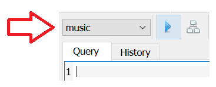

Логички и релацијски оператори - музика
----------------------------------------

Прикажимо сада неколико упита над базом продавнице музичких
композиција.

Упити могу и да се тестирају у систему SQLite Studio. Потребно је да се кликне на креирану базу у
прозору ``Databases`` и потом изабере команда менија ``Tools → Open SQL Editor``. 
Када се напише упит, кликне се на дугме ``Execute query (F9)`` (плави троуглић). 
Како највероватније имамо више база података, обавезно проверите да ли је поред овог дугмета 
назив базе у којој желите да вршите упите.

Савет је да се у прозору ``Databases`` увек прво провере тачни називи табела. 

.. image:: ../../_images/music2.png
   :width: 350
   :align: center

.. questionnote::

   Приказати податке о песмама које заузимају више од 10 милиона бајтова.

   
.. code-block:: sql

   SELECT *
   FROM kompozicija
   WHERE velicina >= 10000000;

Извршавањем упита добија се следећи резултат:

.. csv-table::
   :header:  "id_kompozicija", "naziv", "id_album", "id_format", "id_zanr", "trajanje", "velicina", "cena"
   :align: left

   "1", "For Those About To Rock (We Salute You)", "1", "1", "1", "343719", "11170334", "0.99"
   "15", "Go Down", "4", "1", "1", "331180", "10847611", "0.99"
   "17", "Let There Be Rock", "4", "1", "1", "366654", "12021261", "0.99"
   "19", "Problem Child", "4", "1", "1", "325041", "10617116", "0.99"
   "20", "Overdose", "4", "1", "1", "369319", "12066294", "0.99"
   ..., ..., ..., ..., ..., ..., ..., ...

.. questionnote::

   Приказати називе песама које су краће од 3 минута, тј. 180000 милисекунди.
   
.. code-block:: sql

   SELECT naziv
   FROM kompozicija
   WHERE trajanje < 180000;

Извршавањем упита добија се следећи резултат:

.. csv-table::
   :header:  "naziv"
   :align: left

   "Right Through You"
   "We Die Young"
   "Samba De Uma Nota Só (One Note Samba)"
   "Por Causa De Você"
   "Fotografia"
   ...

.. questionnote::

   Приказати називе песама које трају између 3 минута и 4 минута
   (тј. између 180000 и 240000 милисекунди, укључујући и те границе).
   
.. code-block:: sql

   SELECT naziv
   FROM kompozicija
   WHERE trajanje BETWEEN 180000 AND 240000;

Извршавањем упита добија се следећи резултат:

.. csv-table::
   :header:  "naziv"
   :align: left

   "Fast As a Shark"
   "Put The Finger On You"
   "Let's Get It Up"
   "Inject The Venom"
   "Snowballed"
   ...

.. questionnote::

   Приказати све називе песама које почињу речју `Love`.

.. code-block:: sql

   SELECT *
   FROM kompozicija
   WHERE naziv LIKE 'Love%';

Извршавањем упита добија се следећи резултат:

.. csv-table::
   :header:  "id_kompozicija", "naziv", "id_album", "id_format", "id_zanr", "trajanje", "velicina", "cena"
   :align: left

   "24", "Love In An Elevator", "5", "1", "1", "321828", "10552051", "0.99"
   "56", "Love, Hate, Love", "7", "1", "1", "387134", "12575396", "0.99"
   "413", "Loverman", "35", "1", "3", "472764", "15446975", "0.99"
   "440", "Love Gun", "37", "1", "1", "196257", "6424915", "0.99"
   "493", "Love Is Blind", "40", "1", "1", "344999", "11409720", "0.99"
   ..., ..., ..., ..., ..., ..., ..., ...

.. questionnote::

   Приказати све жанрове чија имена садрже реч `Rock`.

.. code-block:: sql

   SELECT *
   FROM zanr
   WHERE naziv LIKE '%Rock%';

Извршавањем упита добија се следећи резултат:

.. csv-table::
   :header:  "id_zanr", "naziv"
   :align: left

   "1", "Rock"
   "5", "Rock And Roll"

.. questionnote::

   Приказати све извођаче чија имена садрже реч `Orchestra` или
   `Symphony`.

.. code-block:: sql

   SELECT *
   FROM izvodjac
   WHERE naziv LIKE '%Orchestra%' OR naziv LIKE '%Symphony%';

Извршавањем упита добија се следећи резултат:

.. csv-table::
   :header:  "id_izvodjac", "naziv"
   :align: left

   "192", "DJ Dolores & Orchestra Santa Massa"
   "210", "Hilary Hahn, Jeffrey Kahane, Los Angeles Chamber Orchestra & Margaret Batjer"
   "217", "Royal Philharmonic Orchestra & Sir Thomas Beecham"
   "220", "Chicago Symphony Chorus, Chicago Symphony Orchestra & Sir Georg Solti"
   "223", "London Symphony Orchestra & Sir Charles Mackerras"
   ..., ...

.. questionnote::

   Приказати све податке о композицијама које су краће од 10 минута
   (600000 милисекунди), а које коштају долар или више.

.. code-block:: sql

   SELECT *
   FROM kompozicija
   WHERE cena >= 1.00 AND trajanje < 600000;

Извршавањем упита добија се следећи резултат:

.. csv-table::
   :header:  "id_kompozicija", "naziv", "id_album", "id_format", "id_zanr", "trajanje", "velicina", "cena"
   :align: left

   "3339", "LOST Season 4 Trailer", "261", "3", "21", "112712", "20831818", "1.99"
   "3340", "LOST In 8:15", "261", "3", "21", "497163", "98460675", "1.99"

Вежба
.....

Покушај сада да самостално решиш наредних неколико задатака.

.. questionnote::

   Приказати називе свих композиција који на крају имају реч *you*.

.. dbpetlja:: db_operatori_zadaci_muzika_01
   :dbfile: music.sql
   :showresult:
   :solutionquery: SELECT naziv
                   FROM kompozicija
                   WHERE naziv LIKE '% you'

.. questionnote::

   Приказати имена и презимена и земљу свих купаца који се зову *Luis*
   а нису из Бразила.

.. dbpetlja:: db_operatori_zadaci_muzika_02
   :dbfile: music.sql
   :showresult:
   :solutionquery: SELECT ime, prezime, drzava
                   FROM kupac
                   WHERE ime = 'Luis' AND drzava != 'Brasil'

.. questionnote::

   Приказати имена, презимена и датуме рођења свих запослених који су
   рођени током 1970-их.

.. dbpetlja:: db_operatori_zadaci_muzika_03
   :dbfile: music.sql
   :showresult:
   :solutionquery: SELECT ime, prezime, datum_rodjenja
                   FROM zaposleni
                   WHERE datum_rodjenja BETWEEN '1970-01-01' AND '1979-12-31'

