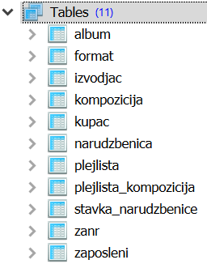

Изрази и функције - музика
--------------------------
Прикажимо сада неколико упита над базом продавнице музичких композиција.
Упити могу и да се тестирају у систему SQLite Studio. Потребно је да се кликне на 
креирану базу у прозору ``Databases`` и потом изабере команда менија ``Tools → Open SQL Editor``. 
Када се напише упит, кликне се на дугме ``Execute query (F9)`` (плави троуглић).

Савет је да се у прозору ``Databases`` увек прво провере тачни називи табела, 
а за сваку табелу и тачни називи колона. 

.. questionnote::

   Приказати називе свих песама које трају више од 4 и по минута.
   
.. code-block:: sql

   SELECT naziv
   FROM kompozicija
   WHERE trajanje > 4.5 * 60 * 1000;

Извршавањем упита добија се следећи резултат:

.. csv-table::
   :header:  "naziv"
   :align: left

   "For Those About To Rock (We Salute You)"
   "Balls to the Wall"
   "Princess of the Dawn"
   "Spellbound"
   "Go Down"
   ...

.. questionnote::

   Приказати називе свих песама и њихову величину у мегабајтима,
   заокружену на две децимале.

.. code-block:: sql

   SELECT naziv, round(velicina / (1024 * 1024), 2) AS Mb
   FROM kompozicija;

Извршавањем упита добија се следећи резултат:

.. csv-table::
   :header:  "naziv", "Mb"
   :align: left

   "For Those About To Rock (We Salute You)", "10.0"
   "Balls to the Wall", "5.0"
   "Fast As a Shark", "3.0"
   "Restless and Wild", "4.0"
   "Princess of the Dawn", "5.0"
   ..., ...

.. questionnote::

   Приказати називе свих композиција, њихово трајање у секундама и
   ознаке за дужине. Кратке (``kratka``) су оне које су краће од три
   минута, средње (``srednja``) су оне између 3 и 6 минута, а дуге
   (``duga``) оне које су дуже од 6 минута.

   
.. code-block:: sql

   SELECT naziv, round(trajanje / 1000) AS sekunde,
          CASE
             WHEN trajanje < 3 * 60 * 1000 THEN 'kratka'
             WHEN trajanje < 6 * 60 * 1000 THEN 'srednja'
             ELSE 'duga'
          END AS duzina
   FROM kompozicija;

Извршавањем упита добија се следећи резултат:

.. csv-table::
   :header:  "naziv", "sekunde", "duzina"
   :align: left

   "For Those About To Rock (We Salute You)", "343.0", "srednja"
   "Balls to the Wall", "342.0", "srednja"
   "Fast As a Shark", "230.0", "srednja"
   "Restless and Wild", "252.0", "srednja"
   "Princess of the Dawn", "375.0", "duga"
   ..., ..., ...

.. questionnote::

   За сваку песму приказати идентификатор, назив и трајање у минутима
   и секундама.
   
.. code-block:: sql

   SELECT id_kompozicija, naziv,
          CAST (round(trajanje / 1000) AS INTEGER) / 60 AS minuti,
          CAST (round(trajanje / 1000) AS INTEGER) % 60 AS sekunde
   FROM kompozicija;

Извршавањем упита добија се следећи резултат:

.. csv-table::
   :header:  "id_kompozicija", "naziv", "minuti", "sekunde"
   :align: left

   "1", "For Those About To Rock (We Salute You)", "5", "43"
   "2", "Balls to the Wall", "5", "42"
   "3", "Fast As a Shark", "3", "50"
   "4", "Restless and Wild", "4", "12"
   "5", "Princess of the Dawn", "6", "15"
   ..., ..., ..., ...

Вежба
.....

Наредних неколико упита напиши самостално.

.. questionnote::

   За сваку ставку наруџбенице прикажи идентификатор *id_naruzbenica*
   и укупну цену (она се добија множењем јединичне цене *cena* и
   количине *kolicina*). Укупну цену прикажи у колони *ukupna_cena*.

.. dbpetlja:: db_izrazi_zadaci_muzika_01
   :dbfile: music.sql
   :checkcolumnname:
   :showresult:
   :solutionquery: SELECT id_narudzbenica, kolicina * cena AS ukupna_cena
                   FROM stavka_narudzbenice

.. questionnote::

   Прикажи називе свих композиција које заузимају више од 10,5 мегабајта.

.. dbpetlja:: db_izrazi_zadaci_muzika_02
   :dbfile: music.sql
   :checkcolumnname:
   :showresult:
   :solutionquery: SELECT naziv
                   FROM kompozicija
                   WHERE round(velicina / (1024 * 1024), 2) > 10.5

   

   

