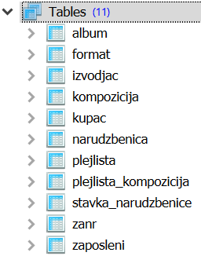

.. -*- mode: rst -*-

Спајање - музика
------------------

У наставку ћемо приказати неколико упита у којима се користи спајање,
а који читају податке из базе компаније која врши продају музичких
композиција.
Упити могу и да се тестирају у систему SQLite Studio. Потребно је да се кликне 
на креирану базу у прозору ``Databases`` и потом изабере команда менија ``Tools → Open SQL Editor``. 
Када се напише упит, кликне се на дугме ``Execute query (F9)`` (плави троуглић).

Савет је да се у прозору ``Databases`` увек прво провере тачни називи табела, 
а за сваку табелу и тачни називи колона. Посебно је важно да проверимо називе 
страног кључа и примарног кључа који му одговара у другој табели када желимо да извршимо 
спајање, тј. да прикажемо податке из више табела које су повезане.

  
.. questionnote::

   Прикажи називе свих песама и њихове жанрове.

.. code-block:: sql

   SELECT kompozicija.naziv AS kompozicija, zanr.naziv AS zanr
   FROM kompozicija JOIN
        zanr ON kompozicija.id_zanr = zanr.id_zanr

Извршавањем упита добија се следећи резултат:

.. csv-table::
   :header:  "kompozicija", "zanr"
   :align: left

   "For Those About To Rock (We Salute You)", "Rock"
   "Balls to the Wall", "Rock"
   "Fast As a Shark", "Rock"
   "Restless and Wild", "Rock"
   "Princess of the Dawn", "Rock"
   ..., ...

.. questionnote::

   Прикажи називе свих џез композиција (жанр је ``Jazz``).

.. code-block:: sql

   SELECT kompozicija.naziv
   FROM kompozicija JOIN
        zanr ON kompozicija.id_zanr = zanr.id_zanr
   WHERE zanr.naziv = 'Jazz'

Извршавањем упита добија се следећи резултат:

.. csv-table::
   :header:  "naziv"
   :align: left

   "Desafinado"
   "Garota De Ipanema"
   "Samba De Uma Nota Só (One Note Samba)"
   "Por Causa De Você"
   "Ligia"
   ...

.. questionnote::
   
   За сваког извођача приказати укупнан број снимљених минута,
   заокружен на две децимале.

.. code-block:: sql

   SELECT izvodjac.naziv, round(SUM(kompozicija.trajanje) / (1000.0 * 60.0), 2) AS minuti
   FROM kompozicija JOIN
        album ON kompozicija.id_album = album.id_album JOIN
        izvodjac ON izvodjac.id_izvodjac = album.id_izvodjac
   GROUP BY izvodjac.id_izvodjac

Извршавањем упита добија се следећи резултат:

.. csv-table::
   :header:  "naziv", "minuti"
   :align: left

   "AC/DC", "80.89"
   "Accept", "20.01"
   "Aerosmith", "73.53"
   "Alanis Morissette", "57.52"
   "Alice In Chains", "54.16"
   ..., ...

.. questionnote::

   Прикажи називе свих поп композиција (жанр је ``Pop``) које су
   снимљене у формату (``AAC``).

.. code-block:: sql

   SELECT kompozicija.naziv
   FROM kompozicija JOIN
        zanr ON kompozicija.id_zanr = zanr.id_zanr JOIN
        format ON kompozicija.id_format = format.id_format
   WHERE zanr.naziv = 'Pop' AND format.naziv LIKE '%AAC%'

Извршавањем упита добија се следећи резултат:

.. csv-table::
   :header:  "naziv"
   :align: left

   "Instant Karma"
   "#9 Dream"
   "Mother"
   "Give Peace a Chance"
   "Cold Turkey"
   ...

.. questionnote::

   За сваког извођача приказати број композиција снимљених у MPEG
   формату. Занемарити оне извођаче који имају мање од 5 таквих
   композиција.

.. code-block:: sql
                
   SELECT izvodjac.naziv, COUNT(*) AS broj
   FROM kompozicija JOIN
        album ON kompozicija.id_album = album.id_album JOIN
        izvodjac ON izvodjac.id_izvodjac = album.id_izvodjac JOIN
        format ON kompozicija.id_format = format.id_format
   WHERE format.naziv LIKE '%MPEG%'
   GROUP BY izvodjac.id_izvodjac
   HAVING broj >= 5

Извршавањем упита добија се следећи резултат:

.. csv-table::
   :header:  "naziv", "broj"
   :align: left

   "AC/DC", "18"
   "Aerosmith", "15"
   "Alanis Morissette", "13"
   "Alice In Chains", "12"
   "Antônio Carlos Jobim", "31"
   ..., ...

   
.. questionnote::

   Прикажи називе свих песама групе *Queen*.
   
.. code-block:: sql

   SELECT kompozicija.naziv
   FROM kompozicija JOIN
        album ON kompozicija.id_album = album.id_album JOIN
        izvodjac ON izvodjac.id_izvodjac = album.id_izvodjac
   WHERE izvodjac.naziv = 'Queen'

Извршавањем упита добија се следећи резултат:

.. csv-table::
   :header:  "naziv"
   :align: left

   "A Kind Of Magic"
   "Under Pressure"
   "Radio GA GA"
   "I Want It All"
   "I Want To Break Free"
   ...

.. questionnote::

   За сваки жанр приказати назив жанра и просечно трајање композиције
   у секундама (уредити опадајуће по трајању).

   
.. code-block:: sql

   SELECT zanr.naziv, round(AVG(trajanje / 1000)) AS prosecno_trajanje
   FROM kompozicija JOIN
        zanr ON kompozicija.id_zanr = zanr.id_zanr
   GROUP BY zanr.id_zanr
   ORDER BY prosecno_trajanje DESC

Извршавањем упита добија се следећи резултат:

.. csv-table::
   :header:  "naziv", "prosecno_trajanje"
   :align: left

   "Sci Fi & Fantasy", "2911.0"
   "Science Fiction", "2625.0"
   "Drama", "2575.0"
   "TV Shows", "2145.0"
   "Comedy", "1585.0"
   ..., ...

.. questionnote::

   Приказати укупну дужину свих композиција групе *Metallica*.

.. code-block:: sql

   SELECT SUM(trajanje) AS ukupno_trajanje
   FROM kompozicija JOIN
        album ON kompozicija.id_album = album.id_album JOIN
        izvodjac ON izvodjac.id_izvodjac = album.id_izvodjac
   WHERE izvodjac.naziv = 'Metallica'

Извршавањем упита добија се следећи резултат:

.. csv-table::
   :header:  "ukupno_trajanje"
   :align: left

   "38916130"

.. questionnote::

   Приказати извођаче којима је просечна дужина трајања композиције
   између 3 и 4 минута.

.. code-block:: sql

   SELECT izvodjac.naziv, round(AVG(trajanje / (1000.0 * 60.0)), 2) AS prosecno_minuta
   FROM kompozicija JOIN
        album ON kompozicija.id_album = album.id_album JOIN
        izvodjac ON izvodjac.id_izvodjac = album.id_izvodjac
   GROUP BY izvodjac.id_izvodjac
   HAVING prosecno_minuta BETWEEN 3.0 AND 4.0

Извршавањем упита добија се следећи резултат:

.. csv-table::
   :header:  "naziv", "prosecno_minuta"
   :align: left

   "Antônio Carlos Jobim", "3.83"
   "Body Count", "3.13"
   "Buddy Guy", "4.0"
   "Caetano Veloso", "3.79"
   "Chico Buarque", "3.86"
   ..., ...

   
.. questionnote::

   За сваког уметника/групу који има 5 или више албума приказати број
   албума (резултат приказати сортирано по броју албума, опадајуће).
   
.. code-block:: sql

   SELECT izvodjac.naziv, COUNT(*) AS broj_albuma
   FROM izvodjac JOIN
        album ON izvodjac.id_izvodjac = album.id_izvodjac
   GROUP BY izvodjac.id_izvodjac
   HAVING broj_albuma >= 5
   ORDER BY broj_albuma DESC

Извршавањем упита добија се следећи резултат:

.. csv-table::
   :header:  "naziv", "broj_albuma"
   :align: left

   "Iron Maiden", "21"
   "Led Zeppelin", "14"
   "Deep Purple", "11"
   "Metallica", "10"
   "U2", "10"
   ..., ...

.. questionnote::

   За сваког извођача који је снимао композиције у неколико различитих
   жанрова приказати број жанрова у којима је снимао композиције.
   
.. code-block:: sql
   
   SELECT izvodjac.naziv, count(DISTINCT kompozicija.id_zanr) AS broj_zanrova
   FROM kompozicija JOIN
        album ON kompozicija.id_album = album.id_album JOIN
        izvodjac ON izvodjac.id_izvodjac = album.id_izvodjac
   GROUP BY izvodjac.id_izvodjac
   HAVING broj_zanrova > 1
   ORDER BY broj_zanrova DESC

Извршавањем упита добија се следећи резултат:

.. csv-table::
   :header:  "naziv", "broj_zanrova"
   :align: left

   "Iron Maiden", "4"
   "Battlestar Galactica", "3"
   "Lenny Kravitz", "3"
   "Jamiroquai", "3"
   "Gilberto Gil", "3"
   ..., ...

   
.. questionnote::

   Приказати називе свих различитих жанрова композиција групе *Iron
   Maiden*.
   
.. code-block:: sql
   
   SELECT DISTINCT zanr.naziv
   FROM kompozicija JOIN
        album ON kompozicija.id_album = album.id_album JOIN
        izvodjac ON izvodjac.id_izvodjac = album.id_izvodjac JOIN
        zanr ON zanr.id_zanr = kompozicija.id_zanr
   WHERE izvodjac.naziv = 'Iron Maiden'

Извршавањем упита добија се следећи резултат:

.. csv-table::
   :header:  "naziv"
   :align: left

   "Rock"
   "Metal"
   "Heavy Metal"
   "Blues"

.. questionnote::

   За сваког извођача приказати идентификатор, име и укупан број рок
   композиција које је снимио (ако није снимио ни једну, приказати
   нулу).

Пошто се тражи приказ броја композиција за све извођаче, а многи
извођачи нису снимили ниједну рок композицију, потребно је да
употребимо лево спајање.

.. code-block:: sql
                
   SELECT i.naziv, COUNT(k.naziv) AS broj_rok_kompozicija
   FROM (izvodjac i JOIN
         album a ON a.id_izvodjac = i.id_izvodjac)
   LEFT JOIN
        (kompozicija k JOIN
         zanr z ON k.id_zanr = z.id_zanr AND z.naziv = 'Rock') ON a.id_album = k.id_album
   GROUP BY i.id_izvodjac
   ORDER BY broj_rok_kompozicija DESC 

Извршавањем упита добија се следећи резултат:

.. csv-table::
   :header:  "naziv", "broj_rok_kompozicija"
   :align: left

   "Led Zeppelin", "114"
   "U2", "112"
   "Deep Purple", "92"
   "Iron Maiden", "81"
   "Pearl Jam", "54"
   ..., ...

   
Вежба
.....

Покушај да наредних неколико упита напишеш самостално.

.. questionnote::

   Приказати списак композиција који садржи назив извођача и назив композиције.
   
.. dbpetlja:: db_spajanje_muzika_01
   :dbfile: music.sql
   :showresult:         
   :solutionquery: SELECT izvodjac.naziv AS izvodjac, kompozicija.naziv AS kompozicija
                   FROM kompozicija JOIN
                        album ON kompozicija.id_album = album.id_album JOIN
                        izvodjac ON izvodjac.id_izvodjac = album.id_izvodjac

.. questionnote::

   Приказати податке о томе који запослени подноси извештај ком
   запосленом у читљивом формату (у свакој врсти приказати
   идентификатор, име и презиме шефа, а затим идентификатор, име и
   презиме оног коме је та особа шеф).

.. dbpetlja:: db_spajanje_muzika_02
   :dbfile: music.sql
   :showresult:         
   :solutionquery: SELECT z1.id_zaposleni, z1.ime, z1.prezime,
                          z2.id_zaposleni, z2.ime, z2.prezime
                   FROM zaposleni z1 JOIN
                        zaposleni z2 ON z1.id_zaposleni = z2.id_nadredjeni

                        
.. questionnote::

   Приказати имена купаца уз имена запослених који су задужени за
   њихову техничку подршку (сортирати списак по именима запослених, а
   за сваког запосленог по именима купаца).

   
.. dbpetlja:: db_spajanje_muzika_03
   :dbfile: music.sql
   :showresult:         
   :solutionquery: SELECT k.ime, k.prezime, z.ime, z.prezime
                   FROM kupac k JOIN
                        zaposleni z ON k.id_zaposleni = z.id_zaposleni
                        ORDER BY z.prezime, z.ime, k.prezime, k.ime
   
                        
.. questionnote::

   За сваки жанр приказати дужину најкраће и најдуже композиције.
   
.. dbpetlja:: db_spajanje_muzika_04
   :dbfile: music.sql
   :showresult:         
   :solutionquery: SELECT z.naziv, Min(trajanje), Max(trajanje)
                   FROM zanr z JOIN 
                        kompozicija k ON z.id_zanr = k.id_zanr
                   GROUP BY z.id_zanr
    
.. questionnote::

   Приказати број ставки на свакој наруџбеници испорученој у Бразил
   (приказати идентификатор наруџбенице, име и презиме купца и број
   ставки). Резултате сортирати неопадајуће по броју ставки.

.. dbpetlja:: db_spajanje_muzika_05
   :dbfile: music.sql
   :showresult:         
   :solutionquery: SELECT n.id_narudzbenica, k.ime, k.prezime, COUNT(*) AS broj_stavki
                   FROM narudzbenica n JOIN
                        stavka_narudzbenice s ON n.id_narudzbenica = s.id_narudzbenica JOIN
                        kupac k ON n.id_kupac = k.id_kupac
                   WHERE drzava_dostave = 'Brazil'
                   GROUP BY n.id_narudzbenica
                   ORDER BY broj_stavki
                 
.. questionnote::

   Приказати имена, презимена и укупне износе наруџбина (заокружене на
   2 децимале) сваког купца за 3 купца који су направили највеће
   износе наруџбина. Резултат приказати опадајуће по укупном износу.
   
.. dbpetlja:: db_spajanje_muzika_06
   :dbfile: music.sql
   :showresult:         
   :solutionquery: SELECT k.ime, k.prezime, ROUND(SUM(n.ukupan_iznos), 2) AS ukupan_iznos
                   FROM narudzbenica n JOIN
                        kupac k ON k.id_kupac = n.id_kupac
                   GROUP BY k.id_kupac
                   ORDER BY ukupan_iznos DESC
                   LIMIT 3

.. questionnote::

   За сваког запосленог приказати идентификатор, име, презиме, број
   запослених којима је он надређени службеник. Приказати и оне
   запослене којима је тај број једнак нули.

   
.. dbpetlja:: db_spajanje_muzika_07
   :dbfile: music.sql
   :showresult:         
   :solutionquery: SELECT z1.id_zaposleni, z1.ime, z1.prezime,
                          COUNT(z2.id_zaposleni) AS broj_podredjenih
                   FROM zaposleni z1 LEFT JOIN
                        zaposleni z2 ON z1.id_zaposleni = z2.id_nadredjeni
                   GROUP BY z1.id_zaposleni
