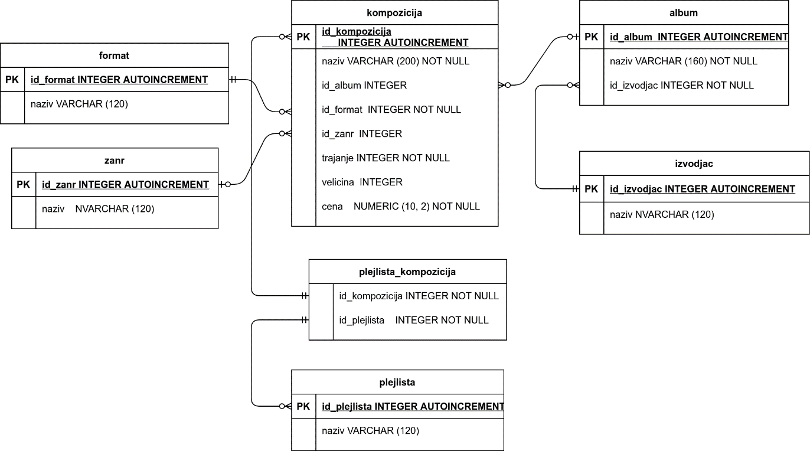
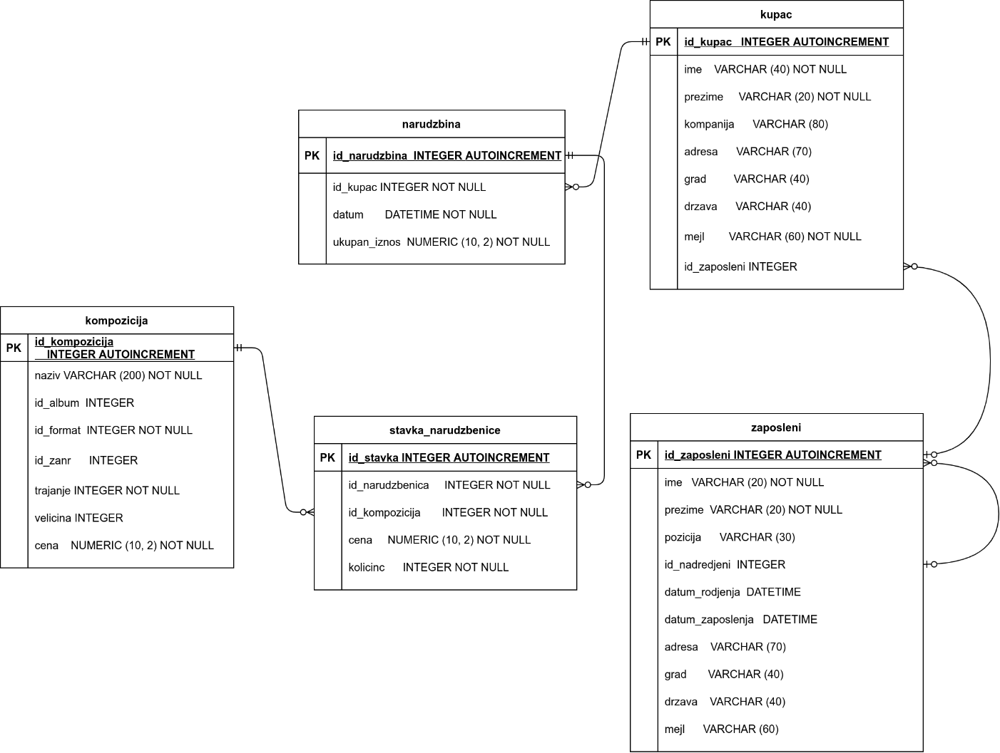
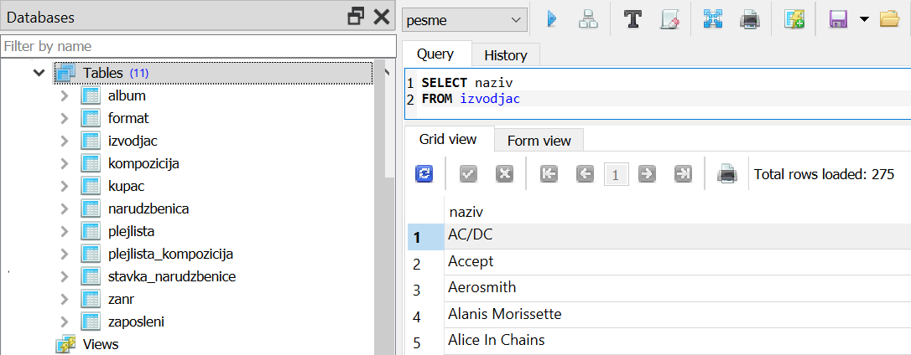

База података компаније за продају дигиталних композиција
==========================================================

Сигурно користиш неку веб-платформу за слушање музике и сигурно си нешто куповао онлајн. Сваки од тих система и њима слични користе базе података. Кроз материјале који следе ћеш се упознати са начином организовања података у релационој бази сличној онима чији си био корисник путем веб или мобилне апликације.

Као пример, показаћемо како изгледа база података једне фиктивне компаније за продају дигиталних композиција (најчешће песама).
Подаци се у релационим базама чувају распоређени по табелама, а табеле су међусобно повезане. Пре креирања базе података се направи њен дизајн. 

На следећој слици се види дизајн дела базе података у којем чувамо податке о композицијама.  На овом моделу се прегледно виде све табеле, све колоне ових табела (списак података које чувао у бази) и све везе између табела. 

Следи део базе података који садржи информације релевантне за продају композиција. Иако се бавимо базом података за компанију која продаје дигиталне композиције, овај део базе је сличан било којој бази у којој чувамо податке о продаји неких производа. Свака таква база има податке о купцима, наруџбинама, производима који се продају (у овом случају су то композиције) и запосленима. 

Следи део базе података који садржи информације релевантне за продају композиција. Иако се бавимо базом података за компанију која продаје дигиталне композиције, овај део базе је сличан било којој бази у којој чувамо податке о продаји неких производа. Свака таква база има податке о купцима, наруџбинама, производима који се продају (у овом случају су то композиције) и запосленима. 

Више о релационим базама података, организацији података по табелама, повезивању табела и дизајнирању база можеш да проучиш у првом поглављу „Базе“ курса „Базе података, рачунарске мреже и серверско веб програмирање за четврти разред гимназије природни смер“:

•	1.0 Базе: Увод у базе података
•	1.1 Базе: SQLite
•	1.2 Базе: Дизајнирање базе података

Све лекције које следе са примерима и задацима прате редом лекције другог поглавља **"SQL"** истог курса. Савет је да увек прво прочиташ лекцију из основног курса, а онда приступиш вежбању задатака у овом практикуму. 

•	2.0 SQL: Читање података и базе
•	2.1 SQL: Пројекција и селекција
•	2.2 SQL: Логички и релацијски оператори
•	2.3 ДОДАТНО SQL: Изрази и функције
•	2.4 SQL: Сортирање, уклањање дупликата, ограничавање броја врста
•	2.5 SQL: Агрегатне функције и груписање
•	2.6 SQL: Спајање табела
•	2.7 SQL: Угњеждени упити
•	2.8 ДОДАТНО SQL: Сложенији угњеждени упити
•	2.9 SQL: Погледи

У колико са базом података желиш да радиш у систему SQLite Studio, целу базу можеш преузети података овде:

`baza <https://petljamediastorage.blob.core.windows.net/root/Media/Default/Kursevi/OnlineNastava/kurs-gim-cetvrti-inf/_static/db/chinook.db>`_ 

У систему SQLite Studio, потребно је да кликне на креирану базу прозору Databases и потом изабере команда менија Tools → Open SQL Editor. 

Када се напише упит, кликне се на дугме Execute query (F9) (плави троуглић). Како највероватније имамо више база података, обавезно проверити да ли је поред овог дугмета назив базе у којој желите да вршите упите.

.. image:: ../../_images/music1.png
  :align: center

.. suggestionnote::
  
   Савет је да се у прозору Databases увек прво провере тачни називи табела. 

   .. image:: ../../_images/music2.png
    :align: center

Често ће нам код упита бити потребно да знамо и тачне називе колона, а понекад нам је значајно и да знамо како су неки подаци записани у бази (да ли су ћирилична слова, да ли су латинична, да ли имена и називи почињу великим словом, итд), па је добро да се пре писања коначног решења задатка прво напише и изврши основни SELECT упит који приказује све податке из табеле.

На следећој слици може да се види упит којим добијамо називе извођача написан и покренут у систему SQLite Studio. Види се само првих неколико редова и информација о томе да има укупно 275 редова у овој табели. 

